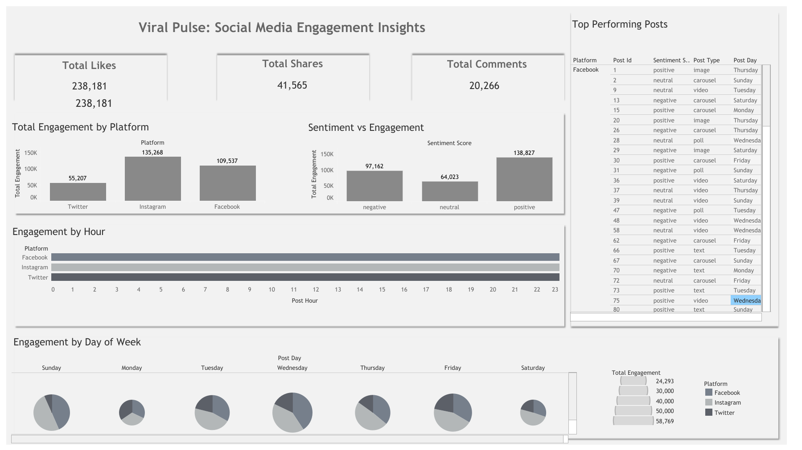
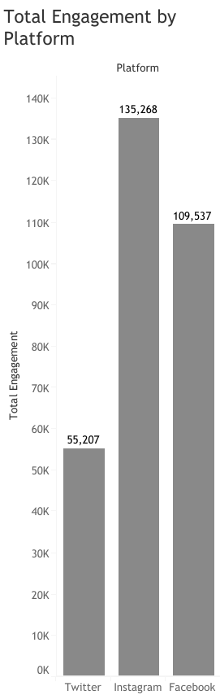
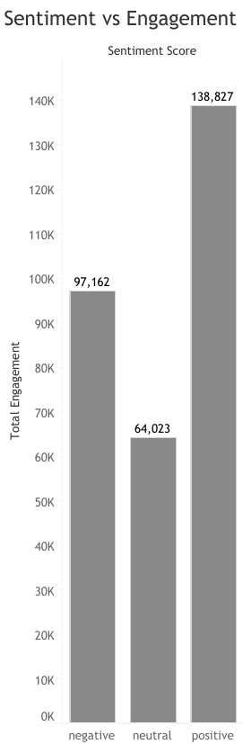
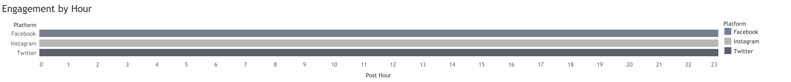
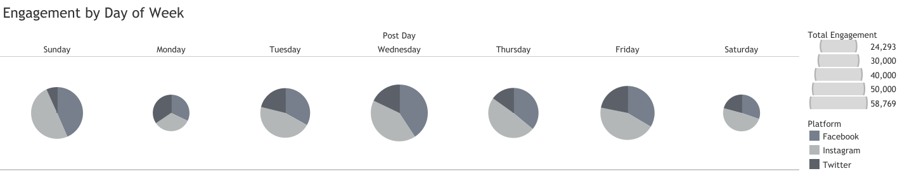

# Viral Pulse: Social Media Engagement Insights 📊📱

This project explores engagement trends across Facebook, Instagram, and Twitter using a synthetic dataset created by **Divya Raj Singh Shekhawat** on Kaggle.

---

## 🔍 Project Overview

**Goal:** Understand how sentiment, content type, platform, and timing influence engagement (likes, comments, shares) in social media.

**Dataset License:** Apache 2.0  
**Author:** Divya Raj Singh Shekhawat  
**Source:** [Kaggle Dataset](https://www.kaggle.com/datasets/divyarajshekhawat/social-media-engagement-analysis)

---

## 📂 Project Structure

```
social-engagement-analysis/
├── data/
├── images/
├── sql/
├── insights/
└── README.md
```

---

## 📊 Tableau Dashboard Preview



### Additional Visuals
- 
- 
- 
- 
- 

---

## 🛠️ Tools Used

- Google BigQuery (SQL transformation)
- Tableau (Interactive visual dashboard)
- Python (Data cleaning)
- GitHub (Documentation and code sharing)

---

## 📌 Questions Answered

- Which platform generates the most engagement?
- Do positive sentiments drive higher interaction?
- Which content formats perform best?
- What’s the optimal day and hour to post?

---

## 🚀 Highlights

- Instagram leads in total engagement.
- Positive sentiment correlates with highest likes/shares.
- Carousels and polls drive high interaction.
- Thursday & Sunday show peak engagement times.

---

**🧠 Analyst:** Issabela Mkhonto  
**📧 Portfolio:** GitHub | Tableau Public
