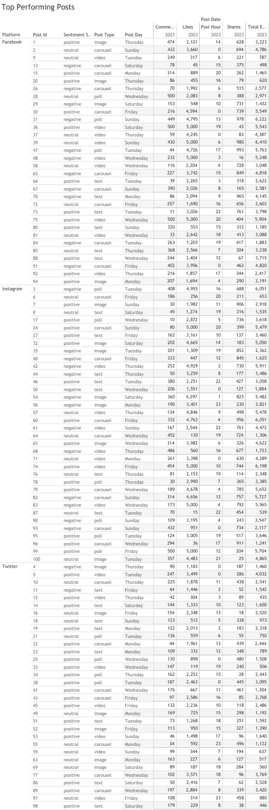

# Viral Pulse: Social Media Engagement Insights 📊📱

This project explores engagement trends across Facebook, Instagram, and Twitter using a synthetic dataset created by **Divya Raj Singh Shekhawat** on Kaggle.

---

## 🔍 Project Overview

**Goal:** Understand how sentiment, content type, platform, and timing influence engagement (likes, comments, shares) in social media.

**Dataset License:** Apache 2.0  
**Author:** Divya Raj Singh Shekhawat  
**Source:** [Kaggle Dataset](https://www.kaggle.com/datasets/divyarajshekhawat/social-media-engagement-analysis)

---

## 📂 Project Structure

```
social-engagement-analysis/
├── data/
├── images/
├── sql/
├── insights/
└── README.md
```

---

## 📊 Tableau Dashboard Preview


---

## 🛠️ Tools Used

- Google BigQuery (SQL transformation)
- Tableau (Interactive visual dashboard)
- Python (Data cleaning)
- GitHub (Documentation and code sharing)

---

## 📌 Questions Answered

- Which platform generates the most engagement?
- Do positive sentiments drive higher interaction?
- Which content formats perform best?
- What’s the optimal day and hour to post?

---
### 🔹 1. **KPI Cards**
**Metrics:**  
- Total Likes: 238,181  
- Total Shares: 41,565  
- Total Comments: 20,266  

These highlight overall performance and scale of engagement across all posts and platforms.
### 🔹 2. **Total Engagement by Platform**
  
**Purpose:** Compare cumulative likes + comments + shares across Facebook, Instagram, and Twitter.  
**Insight:** Instagram had the highest total engagement, followed by Facebook.

---

### 🔹 3. **Sentiment vs. Engagement**
  
**Purpose:** Measure how sentiment affects engagement.  
**Insight:** Positive sentiment posts generated the most engagement, followed by negative posts. Neutral posts underperformed.

---

### 🔹 4. **Engagement by Hour**
  
**Purpose:** Analyze engagement distribution throughout the day.  
**Insight:** Posts made between 6 PM and 10 PM tended to receive higher engagement, with slight platform differences.

---

### 🔹 5. **Engagement by Day of Week**
  
**Purpose:** Identify which days see the highest interaction.  
**Insight:** Thursdays and Sundays stood out across all platforms, especially Instagram.

---

### 🔹 6. **Top Performing Posts**
  
**Purpose:** Showcase the most engaging individual posts, broken down by sentiment, content type, post day, and metrics.  
**Use Case:** Great for identifying patterns among high-performing posts (e.g., carousel on Thursday + positive sentiment = strong performance).


## 🚀 Highlights

- Instagram leads in total engagement.
- Positive sentiment correlates with highest likes/shares.
- Carousels and polls drive high interaction.
- Thursday & Sunday show peak engagement times.

---

**🧠 Analyst:** Issabela Mkhonto  
**📧 Portfolio:** GitHub | Tableau Public: https://public.tableau.com/app/profile/issabela.mkhonto/viz/ViralPulseSocialMediaEngagementInsights/ViralPulseSocialMediaEngagementInsights
